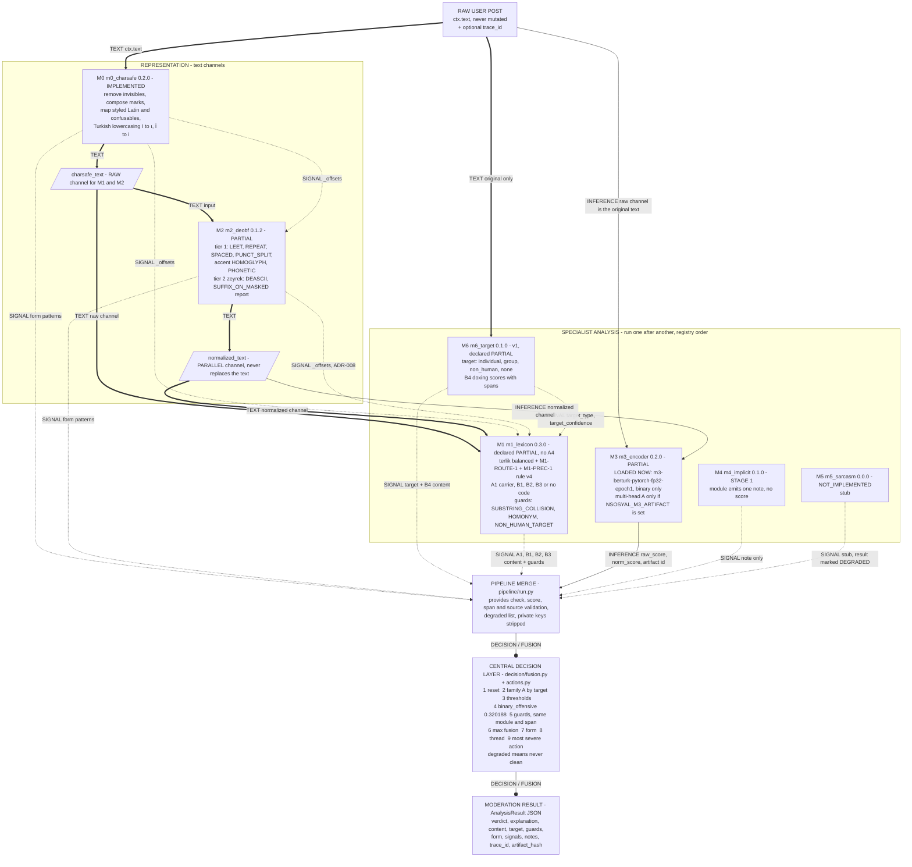
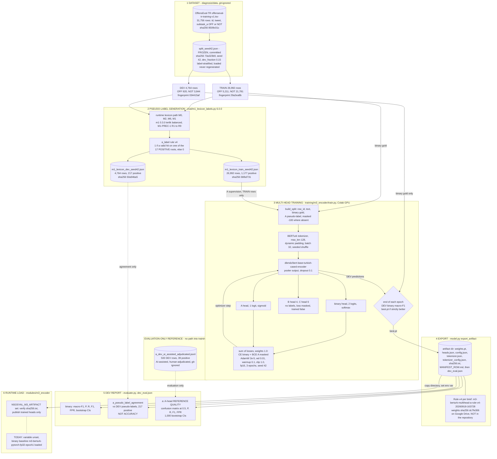
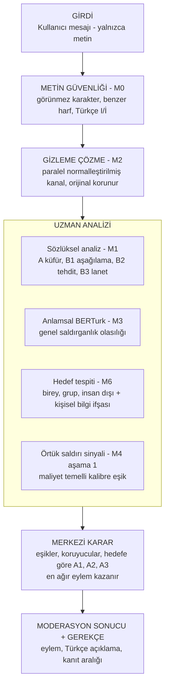

# NSosyal — Complete Data Workflow (reconstructed from the repository)

> **Documentation only.** Reconstructed on 2026-09-18 from branch `audit/m1-m6`, HEAD
> `1beb768c33990b26b30848636931ec35ce9da801`, using the repository as the only source of truth.
> Nothing was trained; no production code, model, threshold, label or contract was changed; no
> commit was made. The only code executed: two read-only runs of the existing pipeline with
> `AI/.venv` (§6) and read-only hash / count checks of committed files.
>
> Status words used: **IMPLEMENTED**, **PARTIAL**, **STAGE 1**, **TRAINED**, **NOT TRAINED**,
> **NOT_IMPLEMENTED (STUB)**, **NOT VERIFIED**. Paths are repository-relative.

---

## 0. Verification summary — where the repository differs from the brief

| # | Brief | What the repository shows | Evidence |
|---|---|---|---|
| 1 | Order M0 → M2 → M6 → M1 → M3 → M4 → M5 → decision | **Confirmed.** The modules run strictly **one after another** in registry order; nothing runs in parallel. "Parallel" in this project means only M2's second text channel. | `AI/modules/registry.py` (`PIPELINE_ORDER`), `AI/pipeline/run.py` (`Pipeline.analyze`) |
| 2 | Rule-v4 is the current M3 artifact | **Not loaded, and not on this machine.** `NSOSYAL_M3_ARTIFACT` is unset at process, user and machine scope, and the repository holds no multi-head `weights.pt`. The runtime therefore loads the binary-only baseline `m3-berturk-pytorch-fp32-epoch1` (sha256 `43a20d55…d4ca`). The Rule-v4 id and the weights sha256 `dc7fe306…0b76` appear only as expected constants in untracked scenario tooling and reports. | `AI/modules/m3_encoder/module.py` (`_load`, `multihead_dir`); live run §6 (`signals.m3_encoder.artifact`); `AI/eval/scenarios/run_demo_scenarios.py` (`RULE_V4_*`); `AI/eval/results/demo_scenario_report.md` §4-5 |
| 3 | Rule-v4 reference result TP 32 / FP 1 / FN 7 / TN 460, P 0.9696969696969697, R 0.8205128205128205, F1 0.8888888888888888, FPR 0.0021691973969631237 | **NOT VERIFIED.** The Rule-v4 `dev_eval.json` is not in the repository. The repository records **exactly these numbers for the Rule-v3 candidate** `m3-berturk-multihead-a-rule-v3-20260918-074806` (weights `41d98d7f…`). Two explanations fit: Rule-v4 produced the same confusion matrix on the 500 rows, or the numbers were copied from the Rule-v3 record. Only the Rule-v4 `dev_eval.json` on Drive can decide. | `AI/docs/training/runs/m3-berturk-multihead-a-rule-v3-20260918-074806.metadata/corrected/dev_eval.json` (`a.A1`); `AI/protocols/m3_a_head_operating_policy.md` §3; `AI/docs/training/m3_rule_v4_handoff.md` §6 |
| 4 | The reference is not used for training or checkpoint selection | **Correct, with one detail.** The training command receives the reference (`--labels-a-reference`), and it is evaluated after every epoch and at export. The result only goes into the report. Checkpoint selection uses DEV binary macro-F1 only. The loss reads only `Row.a` (the pseudo-label). `build_split` raises an error if a reference label falls on a TRAIN row. | `AI/training/m3_encoder/train.py` (epoch loop, `if f1 > best_f1`); `data.py` (`build_split`); `model.py` (`multitask_loss`); `m3_rule_v4_handoff.md` §5 |
| 5 | M4 stage 1 | The m4 **module** emits a single note ("C1–C5 not implemented yet") and no score. Stage 1 is implemented as the `binary_offensive` threshold 0.320188 on M3's raw binary score, which the decision layer applies. That threshold was derived for the **baseline** checkpoint only. | `AI/modules/m4_implicit/module.py`; `AI/decision/thresholds.yaml` (`binary_offensive`) |
| 6 | M5 not implemented | **Confirmed stub** (`stub = True`). Because of it, **every** result is DEGRADED, a CLEAN verdict cannot be reached, and the lowest possible verdict is `review`. | `AI/modules/m5_sarcasm/module.py`; `AI/pipeline/run.py` (stub → degraded); `AI/decision/actions.py` (`DEGRADED_ACTION = Action.REVIEW`) |
| 7 | M6 "v1 implemented", M1 "implemented" | Both run. The repository declares both as **PARTIAL**. M1 lacks the A4 sacred-concept extension. M6's documented ambiguities are pending an owner decision, and it has no person-name gazetteer. | `AI/eval/implementation_status.json` |
| 8 | Target changes A classification | M6 detects the target **before** M1. The A1/A2/A3 code is assigned **only in the decision layer** (ADR-005). M1 uses the target only to raise a NON_HUMAN_TARGET guard. | `AI/decision/fusion.py` (`resolve_family_a`); `AI/modules/m1_lexicon/module.py` (`_non_human_guards`) |
| 9 | M3 text channels | M3's raw channel is the **untouched original** `ctx.text`, not m0's charsafe text. Its normalized channel is m2's `normalized_text`, which is built from m0's **lowercased** charsafe text. | `AI/modules/m3_encoder/module.py` (`_run`) |
| 10 | Frozen split values | **All verified** by recomputation: 31,756 rows, seed 42, train 26,992 / dev 4,764, disjoint. Train fingerprint `29a2ea8b…`, dev fingerprint `034415af…`, split file sha256 `73a323b9…`, corpus sha256 `8509c01c…`. | `diagnosis/data/splits/split_seed42.json`, `diagnosis/data/coltekin/offenseval-tr-training-v1.tsv` |
| 11 | A pseudo-labels TRAIN 1,177 / DEV 217 | **Verified** from the committed derived files: rule v4, taxonomy v3, M1-PREC-1, 0 masked rows. | `AI/eval/derived/m1_lexicon_train_seed42.json`, `…_dev_seed42.json` (headers) |
| 12 | (not in the brief) | Every number in `thresholds.yaml` except `binary_offensive` is a **PLACEHOLDER**: all category thresholds, form, guards and target_min_confidence are 0.50. | `AI/decision/thresholds.yaml` |
| 13 | (not in the brief) | The licensed corpus copy `to drive/nsosyal-train/data/coltekin/offenseval-tr-training-v1.tsv` is untracked but **not git-ignored**. `to drive/.gitignore` names `nsosyal-bstar/`, but the folder is called `nsosyal-train/`. Reported only; nothing was changed. | `git check-ignore` returns no rule; `to drive/.gitignore` |

---

## 1. Runtime / inference data workflow

### 1.1 Where data enters

| Entry | What it accepts | File |
|---|---|---|
| CLI | one or more texts; optional `--trace-id`; optional `--thread '{"sender_id","target_id","thread_id"?}'` | `AI/pipeline/run.py` (`main`) |
| HTTP | `POST /analyze` with JSON `{"text": str, "trace_id"?: str}`; body ≤ 64 KiB; no auth, no TLS | `AI/api/main.py` |
| Library | `Pipeline.analyze(text, thread=None, trace_id=None, thread_block=None)` | `AI/pipeline/run.py` |

The HTTP API accepts **only** the text and an optional trace id. The thread block (sender and target ids) is available only from the CLI or the library.

### 1.2 Pipeline mechanics (apply to every stage)

- **`Context`** (`AI/contracts/module_api.py`, frozen dataclass) is what each module receives. Its fields:
  - `text`: the original, never replaced;
  - `charsafe_text`: set by m0;
  - `normalized_text`: set by m2;
  - `signals`: a deep, read-only copy of every earlier module's signal dict, **including** the private `_` keys;
  - `config`: empty at runtime;
  - `trace_id`.

  `best_text("raw")` returns the charsafe text, or the original when m0 produced none. `best_text("normalized")` is opt-in.
- **`ModuleOutput`** is what each module returns: `charsafe_text`, `normalized_text`, `form`, `content`, `target`, `guards`, `thread`, `signals`, `notes`. `BaseModule` stamps `module`, `version`, `ok` and `latency_ms`.
- **Ownership split** (`AI/contracts/schema.py`): a module fills `code / score / source / span / evidence`. Only the decision layer fills `threshold / fired / active / suppressed`.
- **Merge** (`Pipeline._merge`) drops, and marks the module DEGRADED for, any of the following:
  - fields the module did not declare in `provides`;
  - scores that are NaN, infinite or outside [0, 1];
  - spans outside the original text;
  - a `source` that names another module;
  - a score or guard with no span, for a module that declares `emits_spans = True`.
- **Degradation** is triggered by a stub module, `ok=False`, or dropped output. The module is listed in `signals.pipeline.degraded`, and the first note reads "DEGRADED - judgement incomplete, clean is not reachable".
- **Privacy of internals.** `_`-prefixed signal keys reach later modules but never the response. The charsafe and normalized texts are never put in the response.
- **Fast path:** `fast_path.enabled: false`, so every module always runs.
- **`artifact_hash`** is sha256 over the canonical decision config plus every `module:version`. It does **not** cover model weights. M3's weights identity is `signals.m3_encoder.artifact`.

**Which text each module reads:**

| Module | Reads | Writes text? |
|---|---|---|
| m0_charsafe | `ctx.text` | `charsafe_text` (new string) |
| m2_deobf | `ctx.charsafe_text` (fallback `ctx.text`) + m0 `_offsets`; `ctx.text` for protection and evidence | `normalized_text` (parallel channel) |
| m6_target | `ctx.text` only | no |
| m1_lexicon | raw = `charsafe_text`, normalized = `normalized_text`; m0 and m2 `_offsets`; m6 `target_type` / `target_confidence` | no |
| m3_encoder | raw = `ctx.text` (original); normalized = `normalized_text` | no |
| m4_implicit | nothing | no |
| m5_sarcasm | nothing (stub) | no |

### 1.3 M0 — Character safety · IMPLEMENTED

**Source:** `AI/modules/m0_charsafe/module.py` (v0.2.0), `spec.md`.

**INPUT:** `ctx.text` (the raw string).

**PROCESS:** five passes. Each character is carried as `(orig_start, orig_end, char)`, so offsets survive every pass.

1. `_strip_invisible` removes Unicode Cf/Cc characters (layout TAB, LF and CR are kept) and invisible filler letters (U+115F, U+1160, U+3164, U+FFA0, U+2800). A ZWJ between two emoji parts is kept. Each removal emits `ZERO_WIDTH` with confidence 0.95 inside a word, 0.40 at a word boundary, and 0.05 for a leading BOM.
2. `_handle_combining_marks` composes decomposed letters canonically (s + U+0327 → ş; ZERO_WIDTH 0.05). It strips combining marks stuffed onto Latin letters (ZERO_WIDTH 0.90) and keeps marks on non-Latin scripts.
3. `_map_styled_latin` maps styled Latin to plain letters (HOMOGLYPH 0.80): fullwidth, mathematical alphanumerics, circled / squared / parenthesized / negative forms, superscript and subscript letters, small capitals, and regional indicators that do not form flags. NFKC is never applied to the whole text.
4. `_map_confusables` applies a small Cyrillic / Greek lookalike table. It acts only on tokens that mix in Latin letters (0.90) or consist entirely of lookalikes (0.60).
5. `_turkish_lower` maps I → ı and İ → i, and lowercases everything else one character for one character. A `DOTLESS_I` pattern is emitted only for tokens containing I or İ: 0.90 for a capital I inside a lowercase word, 0.10 for ordinary capitalization. **Plain case folding emits no pattern.**

**OUTPUT** (text modification plus signals):

- `charsafe_text`;
- `form.patterns`: spans in ORIGINAL offsets, `source "m0_charsafe"`;
- signals:
  - `charsafe_changed`: True only if a pattern was emitted, so plain lowercasing leaves it False;
  - `invisible_removed`;
  - `homoglyphs_mapped`;
  - `offsets_identity`;
  - private `_offsets`: the original index of every charsafe character.

**Offsets preserved:** yes, through `_offsets`.

**Downstream consumers:**

- m2 reads the text and `_offsets`;
- m1 reads the raw channel and `_offsets`;
- the decision layer reads `form` to compute `form.active`.

M3 and M6 do **not** read m0's output.

**Deliberately does NOT:** undo leet, spacing or repeats; guess deasciified letters; apply NFKC; normalise accents.

### 1.4 M2 — De-obfuscation · PARTIAL

**Source:** `AI/modules/m2_deobf/module.py` (v0.1.2), `README.md`, `spec.md`, `AI/protocols/ADR-008-normalized-channel-offsets.md`.

**INPUT:**

- `ctx.charsafe_text`, which m0 has already lowercased;
- `ctx.text`, used for protection decisions (original casing) and as evidence;
- m0 `_offsets`.

**PROCESS:**

- `_initial_items` builds a list of `(original index, char)` through m0's `_offsets`.
- `_protect` runs first. These tokens are never repaired:
  - tokens with no letters (numbers, phone and IBAN shapes);
  - @mentions and #hashtags;
  - URLs and e-mails;
  - brand-style digit+capital tokens (3M, COVID-19);
  - apostrophe-suffixed proper nouns;
  - capitalised words that are not at a sentence start;
  - hyphenated acronyms.
- **Tier 1** (always on, no dictionary):
  - `SPACED` (0.85): three or more single letters one space apart become one token.
  - Then, token by token from right to left:
    - `PUNCT_SPLIT` (0.85);
    - `LEET` (0.75) using terlik's LEET_MAP: 0→o, 1→i, 3→e, 4→a, 5→s, 6/9→g, 7→t, 8→b, @→a, $→s, and ! → i only when it is not word-final;
    - `REPEAT` (0.70): a run of three or more identical letters becomes one letter;
    - `PHONETIC` (0.60): q→k, w→v, x→ks;
    - non-Turkish accents → base letter, reported as `HOMOGLYPH` (0.60).
- **Tier 2** (zeyrek word-level analyser, can be disabled):
  - `SUFFIX_ON_MASKED` (0.70) is reported only; the text is not changed.
  - `DEASCII` (0.55): a token that is not a legal word gets Turkish letters restored when exactly **one** candidate spelling is legal.
  - The declared ambiguities (sık/sik, kanı/kani, kısmet/kismet) are never resolved.
  - At most 12 distinct words are analysed per post.

**How variants are represented:** there is **one** normalized string per post. There are no candidate lists or lattices. Each repair is a `Repair(code, confidence, span, before, after)`. It becomes a `FormPattern` whose evidence is the original substring, plus an entry in the private `_repairs` list.

**OUTPUT:**

- `normalized_text`: a parallel text channel;
- `form.patterns`;
- signals `changed`, `codes`, `tier2_enabled`, `offsets_identity`;
- private signals:
  - `_offsets`: the original index of every normalized character (ADR-008);
  - `_repairs`;
  - `_repair_counts`;
  - `_protected_tokens`;
  - `_analyser_calls`.

**Raw text preserved:** yes. `ctx.text` is never touched, and m1 and m3 keep their raw channels.

**How M1 and M3 consume it:**

- m1 scans `normalized_text` as a second channel and maps spans back to the original through m2's `_offsets`.
- m3 scores it for `norm_score`, and, with a multi-head artifact, emits `@normalized` head scores.
- The decision layer fuses per code with `max` over channels. `binary_offensive` thresholds only the raw channel.

**Status:**

| Implemented | Partial | Not implemented |
|---|---|---|
| LEET, REPEAT, SPACED, PUNCT_SPLIT, accent → HOMOGLYPH, PHONETIC, DEASCII (tier 2) | SUFFIX_ON_MASKED (reported, not repaired); DEASCII leaves every ambiguous case alone | ABBREV, VOWEL_DROP, WORD_MERGE, CHAR_DROP, DIALECT, EMOJI_SUB; headline recall-recovery measurement; real-obfuscation human spot-check (`AI/eval/implementation_status.json`) |

### 1.5 M6 — Target detection · v1 running (declared PARTIAL)

**Source:** `AI/modules/m6_target/module.py` (v0.1.0), `AI/protocols/m6_target_guideline.md`, ADR-005, ADR-007. Gazetteers: `gazetteers/groups_tr.txt` and `non_human_tr.txt`, with sha256 in `AI/artifacts/MANIFEST.md`.

**Position:** M6 runs third, **before M1**, because M1 reads its target signal.

**INPUT:** `ctx.text` only, since mentions and casing matter. M6 applies an index-preserving Turkish lowercase.

**PROCESS:**

- **Target candidates:**

  | Type | Trigger | Confidence |
  |---|---|---|
  | individual | @mention | 0.95 |
  | individual | a frozen second-person token (sen, siz, seni, sana …) | 0.90 |
  | individual | a vocative (lan, ulan, be, oğlum …) | 0.75 |
  | individual | a second-person copula / verb ending on a word of ≥4 letters | 0.60 |
  | group | a group gazetteer stem + vowel-harmonic suffixes | 0.85 suffixed, 0.70 bare |
  | non_human | a non-human gazetteer stem | 0.80 |

  Precedence is **individual > group > non_human**, then confidence, then position. The best candidate wins.
- **Doxing (B4):** IBAN (mod-97 checked), TCKN (checksum), mobile and landline numbers, social-profile URLs, e-mail, licence plate, and an address with at least two markers, a digit, a personal cue and no public-place cue. Spans do not overlap.

**OUTPUT:** signals only; the text is never modified.

- `target: TargetResult(type, confidence, evidence, span, source)`, or `None` when there is no candidate.
- `content`: one B4 `ContentScore` per pattern, with `source "m6_target@raw"`, a span, and a fixed confidence: IBAN 0.97, TCKN 0.97, mobile 0.95, landline 0.85, address 0.80, plate 0.70, e-mail 0.60, profile 0.60.
- signals `target_type`, `target_confidence`, `target_evidence {span, how}`, `target_candidates` (at most 8).

**Consumers:**

- m1 reads `target_type` / `target_confidence` to raise the NON_HUMAN_TARGET guard.
- The decision layer reads `result.target` to assign the family-A code, and the B4 scores to apply the B4 threshold (action escalate).

**Before or after lexical classification:** detection happens before M1. The A1/A2/A3 code is assigned after all modules have run, in the decision layer, before any threshold is applied.

**Deliberately does NOT:**

- identify, verify, look up or store any person;
- use a person-name gazetteer or an NER model;
- resolve the documented ambiguities (siz, institution vs members, religion vs followers, sports supporters), which are pending an owner decision (Q28).

### 1.6 M1 — Lexicon / semantic routing · running (declared PARTIAL: A4 missing)

**Source:** `AI/modules/m1_lexicon/module.py` (v0.3.0). Protocols: `AI/protocols/m1_runtime_routing_protocol.md` (M1-ROUTE-1 / 1.1) and `AI/protocols/m1_positive_matching_precision_protocol.md` (M1-PREC-1 = pseudo-label rule v4). Engine: terlik 0.1.0 in balanced mode, pinned in `requirements.txt`.

**INPUT:**

- **raw channel** = `ctx.best_text("raw")` = m0 `charsafe_text`;
- **normalized channel** = `ctx.normalized_text`;
- m0 and m2 `_offsets`;
- m6 `target_type` and `target_confidence`.

**PROCESS, per channel (`_scan`):**

1. Turkish lowercasing, then terlik `get_matches`: dictionary roots plus legal suffixes, tolerant of leet, separators and repetition.
2. `_tighten` cuts a match that runs into the following word back to the matched word.
3. **Clean-context protection:**
   - `CLEAN_PREFIXES` (`amca`, `sikinti`);
   - `CLEAN_WORDS`: the prayer word `amin` / `âmin` / `amîn`;
   - terlik's whitelist.

   A hit on any of these becomes a collision, not a match.
4. **Rule-v4 precision (M1-PREC-1)** applies to candidates of the 17 family-A roots only, and runs before nested-hit filtering. The rules are applied in the order R1 → R5 → R3 → R4 → R2 → R6 → R7 → R8, then R9:
   - **R1:** no letter, e.g. "59" or "6-7".
   - **R5:** a match split across words is rejected unless it is a spaced run of single characters one space apart ("S İ K T İ R" is kept).
   - **R3:** edge punctuation is stripped and glued pieces are split ("(Amin)", "sıkı.").
   - **R4:** the tail of an apostrophe or masked word ("Bel'am").
   - **R2:** a digit at the word edge ("4k", "GOT7").
   - **R6:** a Turkish-letter stem (sık, şık, şik, öç, öc), with a vowel-harmony exception.
   - **R7:** `am` is accepted only in its obscene inflections ("amacı" is rejected); English "I am" is rejected.
   - **R8:** stable clean forms: ak / AK Parti, ananı, gt, gta, all-caps GOT, pc, book.
   - **R9:** an asterisk may complete a root ("ta*ak" → taşak).

   Joiners between letters (a.q, o.ç, g.t) stay inside the word. A rejected candidate becomes `SUBSTRING_COLLISION` evidence `"rule-v4 R<n>: …"`.
5. **Non-A (EXCLUDED) roots** keep the M1-ROUTE-1 §5 / 1.1 fixes: `allık` is a clean word, a match split across words is rejected, compound roots keep their component boundaries ("geri zekalı"), and trailing punctuation is cut.
6. Any other word token containing a root substring becomes a `SUBSTRING_COLLISION` (e.g. "sik" in "psikoloji").
7. Spans are mapped back to ORIGINAL offsets. When a channel has no offset map, M1 reports only the flag in a note and emits no scored item.

**Routing** (data in `module.py`, pinned to the protocol by tests; the five sets partition terlik's 147 roots):

| Route | Roots | Emitted content code | Examples |
|---|---|---|---|
| **A** | 17 | **A1** (the family-A *carrier*; the final A1/A2/A3 is set by the decision layer) | am, amcı, amk, bok, gavat, göt, hassiktir, orospu, oç, pezevenk, piç, sakso, sg, sik, sktrgt, taşak, yarrak |
| **B1** | 100 | B1 degradation | aptal, salak, şerefsiz, gerizekalı, mal, domuz, eşek … |
| **B2** | 7 | B2 threat | öldürücem, kafanıkırarım, boğazınıkeserim, mezarınıkazarım … |
| **B3** | 9 | B3 curse / exclusion | allahbelanıversin, geber, defol, cehenneme, kesilesi … |
| **NONE** | 14 | **no content code** (still counted as a match, a hit and a matched root) | meme, kaşar, fuhuş, dolandırıcı, döl, kaybol … |

A4, B4, B5, C and D are never produced by M1. In code, the "no content code" route is named `NONE` (`ROUTE_CLASSES["NONE"] = (ROUTE_NONE, None)`).

**Emitted content:** each is a `ContentScore(code, score=1.0, source="m1_lexicon@raw" | "m1_lexicon@normalized", span=<original offsets>)`, one per (code, span) per channel. The score is deterministic, not a probability.

**Guards** (`GuardResult`, `source "m1_lexicon"`):

- `SUBSTRING_COLLISION` (1.0), on the collision word.
- `HOMONYM` (1.0) in these declared contexts:
  - "am" as a time abbreviation ("10 am", am/pm);
  - "mal" followed by varlığı, sahibi, mülk, beyan, bildirim, müdür or "ve hizmet";
  - "domuz" followed by eti, et or gribi.
- `NON_HUMAN_TARGET`, with score = m6's `target_confidence`, on each span of M1's own content when m6 reports `non_human`.

**Signals:** `lexicon_hit`, `lexicon_hit_raw`, `lexicon_hit_norm`, `matched_roots`, `engine`, and the private `_matches: [{root, channel, span, route}]`. `_matches` includes NONE-route matches, and the pseudo-label generator reads it.

**Real data object** (from the §6 run; the public part is copied from the response, `_matches` from the module output):

```json
"m1_lexicon": {"lexicon_hit": true, "lexicon_hit_raw": true, "lexicon_hit_norm": true,
               "matched_roots": ["piç"], "engine": "terlik 0.1.0 balanced"}
"_matches":   [{"root": "piç", "channel": "raw", "span": [8, 14], "route": "A"},
               {"root": "piç", "channel": "normalized", "span": [8, 14], "route": "A"}]
guard:        {"code": "SUBSTRING_COLLISION", "score": 1.0, "source": "m1_lexicon",
               "evidence": "raw: am in amcam", "span": [16, 21]}
```

**How the target interacts with family A:**

- M1 always emits **A1**.
- The decision layer (`resolve_family_a`) recodes every A1/A2/A3 score, from any module, by `family_a.by_target`: none → A1, individual → A2, group → A3, non_human → A1.
- A target below `target_min_confidence` 0.50 counts as none.
- For a non_human target, M1's NON_HUMAN_TARGET guard can then suppress M1's own A1/A2/A3 and B1 scores on overlapping spans.
- B1/B2/B3 are never recoded by target. B2 and B3 are not suppressible by NON_HUMAN_TARGET.

### 1.7 M3 — Transformer encoder · PARTIAL (binary baseline loaded)

**Source:** `AI/modules/m3_encoder/module.py` (v0.2.0), `spec.md`, `AI/artifacts/MANIFEST.md`.

`_load` chooses one of two modes:

| | **Binary baseline** (default, **active now**) | **Multi-head artifact** (only when `NSOSYAL_M3_ARTIFACT` points to a directory) |
|---|---|---|
| Files | `AI/artifacts/m3_encoder/berturk_epoch1.pt` (git-ignored) + `AI/artifacts/m3_encoder/tokenizer/{config.json, tokenizer.json, tokenizer_config.json}`; can be overridden with `NSOSYAL_M3_CHECKPOINT` / `NSOSYAL_M3_TOKENIZER` | `weights.pt`, `heads.json`, `config.json`, `tokenizer.json`, `tokenizer_config.json`, `sha256.txt` |
| Integrity | Hard-coded sha256 for the checkpoint (`43a20d55…d4ca`) and the three tokenizer files. A missing file or a mismatch fails the load, and the module is DEGRADED. | Every line of `sha256.txt` is verified. A directory without `sha256.txt` is refused. |
| Model | `AutoModelForSequenceClassification` (2 labels) | `AutoModel` encoder + head tensors applied with `F.linear` on `pooler_output` (fallback: the CLS vector) |
| Artifact id | `m3-berturk-pytorch-fp32-epoch1` | `heads.json["artifact_id"]` |

**Model and tensor preparation:**

- Base: `dbmdz/bert-base-turkish-cased`. Its config: `bert`, `hidden_size` 768, `vocab_size` 32000; tokenizer `do_lower_case: false`.
- Tokenizer: `AutoTokenizer.from_pretrained(dir, local_files_only=True)` (BertTokenizer).
- Tensors: one post per call, `truncation=True, max_length=128` (the first tokens are kept), no padding, `return_tensors="pt"`.
- Inference: FP32 on CPU, eval mode, `torch.no_grad()`.

**Channels:**

- raw = `ctx.text`, the original cased text;
- normalized = `ctx.normalized_text`.

When the normalized text equals `ctx.text`, the raw result is reused instead of running a second pass.

**Outputs:**

- **Signals:**
  - `raw_score` = softmax(binary logits)[1], the probability of OFF;
  - `norm_score`, computed the same way on the normalized channel;
  - `artifact`;
  - `truncated_differently`;
  - private `_truncation` (token counts);
  - a note whenever a channel exceeds 128 tokens.
- **Content:**
  - **Baseline:** none. Owner decision: OFF is not "profanity present".
  - **Multi-head:** scores come only from heads with `trained: true`. They carry **no span** (`emits_spans = False`) and have `source "m3_encoder@raw|@normalized"`:

    | Head | Activation | Code(s) |
    |---|---|---|
    | A | sigmoid | A1 carrier |
    | B | sigmoid each | B1, B2, B3, B5 |
    | C | softmax (NONE class dropped) | C1..C5 |

**Heads in the recorded multi-head artifacts:** binary and A are `trained: true`; B and C are `trained: false`, so they are never published (`heads.json`).

**Threshold usage:**

- Inside the module: none.
- In the decision layer:
  - binary `raw_score` ≥ 0.320188 → `review`;
  - an A1 content score is recoded by target, then compared with A1 / A2 / A3 = 0.50 (placeholders).

  A-OP-1 fixes 0.50 for the **Rule-v3** candidate only. No Rule-v4 operating policy is recorded (`m3_rule_v4_handoff.md` §6).

**Provenance:** every result carries `signals.m3_encoder.artifact`. `artifact_hash` does not cover the weights.

**Rule-v4 availability:** not loaded, not present locally (§0 #2). If it were loaded, the code implies the following (not executed):

- **(a) Guards cannot reach M3's A scores.** M3's A1 scores would be added with no span and from a different module. Under ADR-001 (`guard_applies`), M1's SUBSTRING_COLLISION, HOMONYM and NON_HUMAN_TARGET guards could **never** suppress them.
- **(b) The binary threshold would be applied outside its derivation.** The binary `raw_score` would come from the Rule-v4 binary head, but it would still be compared with 0.320188. `thresholds.yaml` states that value is valid only for the baseline checkpoint, and no code checks the artifact id against the threshold file.

### 1.8 M4 — Implicit attack · STAGE 1 only

**Source:** `AI/modules/m4_implicit/module.py` (v0.1.0), `spec.md`, `AI/protocols/ADR-006-m4-thresholds-c-head-stage-1.md`, `AI/protocols/threshold_derivation_binary_offensive_stage1.md`, `AI/protocols/m4_stage1b_protocol.md`.

- **The module:** reads nothing, computes nothing, and returns `notes=["C1–C5 not implemented yet"]`. It is not a stub, so it does not degrade the result.
- **Where stage 1 acts:** in the decision layer, `apply_binary_offensive` reads `m3_encoder.raw_score` and flags the post when the score is ≥ `binary_offensive.threshold` = **0.320188**, which triggers action `review`. The threshold is:
  - **derived** with cost ratio r = 3 on the CAL half (n = 2,382) of the frozen dev split;
  - valid only for `m3-berturk-pytorch-fp32-epoch1`;
  - applied to the raw channel only;
  - not suppressible by any guard.
- **Stage 1b** (the same threshold conditioned on `m1_lexicon.lexicon_hit`) was measured and **not adopted**.
- **Stage 2** (influence-function hardening) is **not implemented**.
- C1–C5 thresholds exist as placeholders, but no module emits C scores.

### 1.9 M5 — Sarcasm · NOT_IMPLEMENTED (STUB)

**Source:** `AI/modules/m5_sarcasm/module.py` (v0.0.0, `stub = True`), `spec.md`, ADR-003.

**Runtime:** M5 returns `notes=["stub: detection not implemented"]` and no content. The pipeline marks it DEGRADED (kind `stub`) before any module runs.

**Contracted interface** (spec §7, **not implemented**): reads `ctx.text` raw; writes `out.content` for D1; never sets threshold or fired. A D1 placeholder (0.50, nudge) exists in `thresholds.yaml`.

**Gate:** the entry gate (spec §2) has not been executed; the MANIFEST row `m5-sarcasm` is TBD.

### 1.10 Central decision layer · IMPLEMENTED (numbers mostly placeholder)

**Source:** `AI/decision/fusion.py`, `AI/decision/actions.py`, `AI/decision/thresholds.yaml` (id `thresholds-v0.1.0`; status `derived` for `binary_offensive` only).

**Signals entering the decision layer:**

| Signal | Origin | Used for |
|---|---|---|
| content A1 (1.0, span) | m1 raw / normalized | family-A code, thresholds |
| content B1 / B2 / B3 (1.0, span) | m1 | thresholds |
| content B4 (fixed confidence, span) | m6 | thresholds |
| content A1 / B* / C* (probabilities, no span) | m3 multi-head only — **none today** | thresholds |
| guards SUBSTRING_COLLISION / HOMONYM / NON_HUMAN_TARGET | m1 | suppression |
| `target` | m6 | family-A code |
| `form.patterns` | m0, m2 | `form.active` only; never affects the verdict |
| `m3_encoder.raw_score` | m3 | `binary_offensive` |
| `m3_encoder.norm_score` | m3 | reported only; no threshold |
| `m1_lexicon.lexicon_hit` | m1 | would feed a `threshold_when` branch; none configured |
| `signals.pipeline.degraded` | pipeline (m5 stub, failures) | fail-closed |
| `thread` (repeat_count, same_target) | `pipeline/thread_counter.py`, CLI / library only | thread rule |
| m4 | — | nothing (it emits a note) |

**Stages, in order** (`decide_post` then `conclude`):

1. **Reset** (`reset_decision_fields`). Any threshold, fired, active or suppressed value a module set is cleared, and the offender is noted.
2. **Family A by target** (`resolve_family_a`, ADR-005).
   - The target counts only if its confidence is ≥ 0.50; otherwise it is "none".
   - Every A1–A3 score is recoded through `by_target`.
   - The audit record goes to `signals.decision.family_a`. A4 is untouched.
3. **Thresholds** (`apply_thresholds`).
   - Each per-module, per-channel score gets its threshold from `categories[code]`, either scalar or a `threshold_when` branch.
   - `fired = score ≥ threshold`. A code with no configured category never fires, and a note records it.
   - Audit: `signals.decision.threshold_branches`.
4. **Binary score** (`apply_binary_offensive`), raw channel only. Audit: `signals.decision.binary_offensive`.
5. **Guards** (`apply_guards`).
   - A guard is active when its score is ≥ 0.50.
   - Guards are applied in the order SUBSTRING_COLLISION → HOMONYM → NON_HUMAN_TARGET.
   - A guard clears a fired score only when all of these hold (ADR-001):
     - it comes from the **same module**;
     - the score's code or family is in the guard's `suppresses` list;
     - the spans **overlap**. When one side has no span, the same-module fallback applies only to modules that declare `emits_spans = False`.
   - Suppression lists: SUBSTRING_COLLISION [A]; HOMONYM [A, B1]; NON_HUMAN_TARGET [A1, A2, A3, B1].
   - Audit, recorded after guards and before fusion: `signals.decision.channel_scores`.
6. **Channel fusion** (`fuse_channels`, strategy `max`). One score per code: the highest one still fired, otherwise the highest overall. The winning source and span are kept.
7. **Form** (`apply_form`). `form.active` = codes with confidence ≥ 0.50. `post_offensive` is then set: some fused content fired, or the binary score fired.
8. **Thread rule** (`apply_thread`). It fires only when all of these hold:
   - the rule is enabled;
   - the post itself is offensive;
   - `repeat_count` ≥ 3;
   - `same_target` is true.

   The window is 600 s, a placeholder.
9. **Verdict** (`actions.resolve`).
   - The verdict is the most severe action among fired content codes, the binary score (`review`) and the thread rule (`escalate`).
   - Precedence: BLOCK > ESCALATE > REVIEW > NUDGE > CLEAN. On a tie, the higher score is kept.
   - If the verdict is still CLEAN and any module is degraded, it becomes **REVIEW** (driver `"degraded"`).
10. **Explanation** (`actions.explain`). Exactly one Turkish sentence. When the result is degraded, it adds "; ancak değerlendirme eksik çünkü …".

**Current action policy** (all placeholder policy):

| Code | Action |
|---|---|
| A1 | nudge |
| A2 | review |
| A3 | block |
| A4 | review |
| B1 | review |
| B2 | escalate |
| B3 | review |
| B4 | escalate |
| B5 | block |
| C1–C3 | review |
| C4 | escalate |
| C5 | review |
| D1 | nudge |
| binary | review |
| thread | escalate |

**How conflicts are handled:**

- **Several codes:** the most severe action wins. There is no voting or weighting.
- **The same code from several modules or channels:** the maximum score wins.
- **Guard vs content:** a guard wins only within the same module and on an overlapping span.
- **Lexicon vs model:** there is no arbitration. The binary score can raise the verdict to `review` on its own but can never lower a lexical verdict.
- **Degraded:** the verdict is never clean.

**What the final result exposes** (`AnalysisResult.to_dict`):

| Capability | Supported? | Field(s) |
|---|---|---|
| Final moderation label | yes | `verdict` ∈ block / escalate / review / nudge / clean (clean unreachable while M5 is a stub) |
| Reason / code | yes | fused `content[]` with `fired`; `explanation` names the driving code |
| Target | yes | `target {type, confidence, evidence, span, source}`; `signals.decision.family_a` |
| Confidence / probability | partial | per-code `score` (m1 always 1.0, m6 fixed values); M3 binary probability in `signals.m3_encoder.raw_score` / `norm_score` and `signals.decision.binary_offensive.channels.raw.score`. **No overall calibrated confidence field.** |
| Evidence / spans | yes | content, guard, target and form spans in ORIGINAL offsets; guard and form `evidence` strings |
| Module provenance | yes | `source "<module>@<channel>"`, `per_module_ms`, `signals.<module>`, `signals.pipeline.degraded`, `signals.m3_encoder.artifact`, `artifact_hash`, `trace_id`, `notes` (no explicit module-version field; versions enter only `artifact_hash`) |

---

## 2. Offline training / evaluation data workflow

`RAW DATASET → INGESTION → SPLIT → LABEL GENERATION → TRAINING → DEV EVALUATION → ARTIFACT EXPORT → RUNTIME LOAD`

### 2.1 Dataset (verified)

| Item | Value | Evidence |
|---|---|---|
| File | `diagnosis/data/coltekin/offenseval-tr-training-v1.tsv` (git-ignored, `diagnosis/.gitignore` `data/**`) | read by `diagnosis/src/data_io.py::load_coltekin_train`; `AI/training/m3_encoder/data.py` (`NSOSYAL_DATA` override) |
| Columns | `id`, `tweet`, `subtask_a` (OFF / NOT) | header verified |
| Rows | 31,756 | counted |
| sha256 | `8509c01c4bf387d9e387c4637829585431cc045adaf7d0413c0022bf2bcd4baa` | recomputed; pinned as `TRAIN_SHA256` / `CORPUS_SHA256` |
| Row identifier | corpus `id`, used as `row_id` everywhere | `data.py::build_split` |
| Original label | binary OFF / NOT only. **No A/B/C codes exist in the corpus.** | `eval/m1_lexicon_labels.py` `LIMITS` |
| Colab copy | Drive `MyDrive/nsosyal-train/data/coltekin/…` (same sha256; a local staging copy sits in `to drive/`) | `m3_rule_v4_handoff.md` §2 |
| Banned datasets | `Toygar/turkish-offensive-language-detection`, `Overfit-GM/turkish-toxic-language` are refused by name | `data.py::BANNED_DATASETS` |
| Official test set | locked, and a spend record forbids reading it again; label generation refuses paths containing `testset` / `labela` | `diagnosis/src/data_io.py::load_coltekin_test`; `eval/m1_lexicon_labels.py::FORBIDDEN_INPUT_NAMES` |

### 2.2 Split and leakage protection (verified)

**The frozen split file:** `diagnosis/data/splits/split_seed42.json`, committed.

| Property | Value |
|---|---|
| sha256 | `73a323b9e5750faecd557470bb53e27fe26b7fdf7a1ad9da1d365f224dc6d7f2` |
| Created | 2026-08-15 |
| Seed | 42 |
| dev_fraction | 0.15 |
| n_rows | 31,756 |
| TRAIN | 26,992 rows (NOT 21,781 / OFF 5,211); fingerprint `29a2ea8bdc9730bf7a16f6c7e21d69dd3f33648b923f2829e8e2797876bbe931` |
| DEV | 4,764 rows (NOT 3,844 / OFF 920); fingerprint `034415af3a23b388cb2bfbb13fc5eda37e43f71a3542e9ea925de72e06a133b4` |
| Overlap | 0 ids |
| Fingerprint definition | sha256 of the sorted ids joined with "\n" |

**How the split was created (once):** `stratified_split` sorts ids inside each label bucket, shuffles each bucket with `random.Random(42)`, and takes `round(n × 0.15)` per label for DEV.

**Why the split cannot be regenerated by accident:**

- `get_split` **loads** the file whenever it exists. It records `matches_regeneration` as a drift detector and never overrides the file.
- `load_split` raises an error on:
  - a different corpus hash;
  - an id missing from the corpus;
  - any train/dev overlap.
- The M3 trainer (`data.py::load_frozen_split`) raises `LeakageError` when:
  - the split file is missing, since a split must never be created;
  - `reused_existing_file` is false;
  - the dev fingerprint differs from `034415af…`.
- The label generator (`eval/m1_lexicon_labels.py::load_inputs`) re-checks:
  - the corpus and split sha256;
  - the seed;
  - the counts and uniqueness of the ids;
  - that train and dev do not overlap;
  - both fingerprints;
  - the OFF/NOT counts.

  It labels one half per file ("the train run never labels a dev row").
- The evaluation reference must lie inside DEV (`build_split` raises otherwise).

### 2.3 A pseudo-label generation (derived supervision — NOT human ground truth)

**Generator:** `AI/eval/m1_lexicon_labels.py` (generator 6.0.0). Protocols:

- `AI/protocols/m1_lexicon_train_labels_protocol.md`;
- `AI/protocols/m1_lexicon_dev_labels_protocol.md`;
- M1-PREC-1 (`AI/protocols/m1_positive_matching_precision_protocol.md`).

```
corpus row (id, tweet)
 → the RUNTIME lexicon path m0 → m2 → m6 → m1 (same code as inference; m3–m5 not in this pipeline)
 → m1's private _matches (root, channel, span) read by wrapping m1.process (M1MatchTap)
 → valid hit := lexicon_hit_raw OR (lexicon_hit_norm AND a normalized match with a valid span)
 → a_label = 1 if valid hit AND a matched root is in the 17-root POSITIVE set, else 0
   (null/masked only for REVIEW-only roots; the REVIEW class is empty, so 0 masked rows)
 → m1_lexicon_{train,dev}_seed42.json (one file per split)
```

**Rule v4 definition:** the Rule-v3 formula and taxonomy (`taxonomy_version` 3, digest `5b8ebe31…`), with m1 0.3.0 accepting a POSITIVE-root match only as a real word of its root (M1-PREC-1).

**Pinned inputs:** terlik dictionary sha256 `e83a97b3…`; zeyrek tier 2 is required.

**Determinism:** the rows are generated twice and must be byte-identical.

**What each derived file records:** the protocol and matching-protocol digests and commits, git head, module versions, terlik/zeyrek versions, input digests, counts, and `rows_sha256`.

| File (committed) | sha256 | Rows | a_label = 1 | Masked |
|---|---|---|---|---|
| `AI/eval/derived/m1_lexicon_train_seed42.json` | `0bfbd73118c661bbf41468da2c6ee951eaf9f591e8a2d81bfb221a14054504f2` | 26,992 | **1,177** | 0 |
| `AI/eval/derived/m1_lexicon_dev_seed42.json` | `50a94ba513b33e9b09f305af4619aa197a7c4311cca471a3c623978eab41a0dd` | 4,764 | **217** | 0 |

**Row fields:** `row_id`, `lexicon_hit(_raw/_norm)`, `channel`, `a_label`, `a_label_v1`, `roots`, `root_classes`, `matches[channel,start,end,surface]`, `collisions[…]`, `homonyms[…]`.

**Rule-v4 purpose.** Rule v4 is meant to remove lexical false positives from the A supervision while keeping real obfuscated profanity. The flip report (`AI/eval/derived/m1_lexicon_rule_v4_flips.md`) records:

- TRAIN: 1,528 → 1,177 (360 rows 1→0, 9 rows 0→1);
- DEV: 257 → 217 (44 rows 1→0, 4 rows 0→1).

Flipped rows per rule:

| Collision type (brief) | Rule | TRAIN / DEV flipped rows |
|---|---|---|
| Turkish sık / şık / şike / öç | R6 | 118 / 13 |
| English "I am", unrelated "am" words (amacı), prayer word amîn | R7 | 50 / 7 |
| Numeric collisions (no letter, digit at the edge) | R1, R2 | 35+7 / 5+0 |
| Arbitrary cross-word matching ("A mı", "T A M A M") | R5 | 45 / 4 |
| Punctuation / boundary ("(Amin)", "sıkı.") | R3, R4 | 13+2 / 4+0 |
| Benign stable forms / homographs (AK, gt, GOT, pc, book, ananı) | R8 | 95 / 11 |
| Obfuscation **kept or recovered**: masked roots ("ta*ak"), joiners (a.q, g.t), spaced runs ("S İ K T İ R") | R9, R3(c), R5(b) | R9: 9 / 4 |

Runtime HOMONYM guards (mal varlığı, domuz eti, 10 am) are **recorded** in the files but **not applied** to `a_label` (`LIMITS`).

**Label semantics:** these are keyword **pseudo-labels**. An A head trained on them learns the coverage of the POSITIVE set, not what terlik misses. On DEV rows they are used only to report **agreement**, never accuracy.

### 2.4 Model training flow

**Source:** `AI/training/m3_encoder/train.py`, `model.py`, `data.py`. Configuration: `AI/docs/training/m3_rule_v4_handoff.md` §2-3, and the rule-v3 `heads.json` `hyperparams`.

```
build_split(corpus, --labels-a train.json --labels-a dev.json, --labels-a-reference ref.jsonl)
  Row(row_id, text, binary = OFF?1:0, a = pseudo-label | -100, b = (-100,)*4, c = -100, a_reference = 0/1 | -100)
→ tokenizer = AutoTokenizer.from_pretrained("dbmdz/bert-base-turkish-cased")
→ encode: truncation, max_length 128, no padding; label keys attached per item
→ DataLoader(batch_size 32, shuffle with torch.Generator seeded 42, num_workers 0),
  collate = tokenizer.pad(padding=True) → input_ids / attention_mask / token_type_ids + label tensors
→ MultiHeadEncoder: AutoModel.from_pretrained(base) → pooler_output (fallback CLS) → Dropout(0.1)
     heads = Linear(768→2) binary · Linear(768→1) A · Linear(768→4) B · Linear(768→6) C
→ multitask_loss
→ AdamW + LambdaLR → next batch
```

**Loss** (`model.py::multitask_loss`):

- It is a **sum** of the per-head losses, each with weight **1.0** (`train.py` passes no weights):
  - binary: `cross_entropy` over **all** rows;
  - A: `binary_cross_entropy_with_logits`, **masked** to rows where `a != -100`;
  - B: BCE masked to labelled rows;
  - C: CE with `ignore_index=-100`.
- A head with no labelled row in the batch contributes zero.
- Rule-v3 / v4 runs had **no B or C labels**, so only binary + A trained, and the B and C heads were exported with `trained: false`.

**Optimisation:**

- AdamW, lr 2e-5. Weight decay 0.01, except bias and LayerNorm, which get 0.
- Linear warmup over 10 % of the steps, then linear decay to 0.
- Gradient clipping at 1.0; grad-accum 1.
- `--fp16`: autocast + GradScaler, CUDA only.
- 3 epochs, seed 42 (Python, NumPy, torch, CUDA).
- A `latest.pt` checkpoint is saved every epoch, so a run can resume.

**Recorded configuration** (Rule-v3 `heads.json`, identical in the Rule-v4 handoff):

| Setting | Value |
|---|---|
| base | `dbmdz/bert-base-turkish-cased` |
| epochs | 3 |
| batch size | 32 |
| lr | 2e-5 |
| warmup ratio | 0.1 |
| weight decay | 0.01 |
| max_len | 128 |
| seed | 42 |
| fp16 | true |
| max grad norm | 1.0 |
| eval batch size | 64 |

### 2.5 DEV evaluation and checkpoint selection

After every epoch, `evaluate.evaluate_rows` runs on all 4,764 DEV rows and reports:

- **binary** at the reporting point 0.5: macro-F1, OFF recall / precision / F1 / FPR and the confusion matrix, with 1,000 percentile-bootstrap CIs (seed 42);
- **`a_pseudo_label_agreement`**: A predictions vs the DEV pseudo-labels, with the note "**NOT accuracy, NOT a quality claim**";
- **`a`**: A predictions vs the evaluation reference (§2.6), stamped with the reference's kind.

**Checkpoint selection:** `if f1 > best_f1` on **DEV binary macro-F1** only. The best model is saved to `best.pt`. At the end, `best.pt` is re-loaded, exported and evaluated once more; that evaluation becomes `dev_eval.json`.

**Recorded Rule-v3 values** (the only multi-head run whose `dev_eval.json` is in the repository):

- best_epoch 0;
- binary macro-F1 0.8247 [0.8108, 0.8377];
- pseudo-label agreement (support 257): tp 196, fp 22, fn 61, tn 4485 — **agreement, NOT accuracy**.

The Rule-v4 values are **NOT VERIFIED** (no `dev_eval.json` in the repository).

### 2.6 Reference evaluation workflow (A-head quality) — separate from training

**The reference:**

| Item | Value |
|---|---|
| File | `AI/eval/annotation/private/a_dev_ai_assisted_adjudicated.jsonl` (git-ignored) |
| Fields | `row_id`, `label` |
| Rows | 500, all inside DEV |
| Positives | 39 (verified) |
| Sampling | simple random sample without replacement over the sorted DEV ids, seed 42 (`AI/eval/a_head_dev_sample.py`; ids committed in `AI/eval/annotation/a_head_dev_sample_seed42_n500.ids.json`) |

**Kind: `ai-assisted-human-adjudicated`** (`…reference_provenance.json`):

- two AI annotators (Claude / Fable and Gemini) agreed on 497 of 500 rows (κ 0.958);
- the project owner adjudicated only the 3 disagreements;
- 497 labels were never reviewed by a human.

It is **not** a human oracle.

**Guarantees in code:**

- `build_split` refuses a reference label on a TRAIN row.
- The loss reads only `Row.a`.
- Selection reads only binary macro-F1.
- The pseudo-label generator has no path to `eval/annotation/`.
- `evaluate_rows` refuses to evaluate reference rows unless the reference kind is stated.
- `provenance.py` never writes "human" unless the kind is `human`.

**What the reference is not used for:**

- training;
- pseudo-label generation;
- checkpoint selection;
- threshold fitting (A-OP-1 fixes 0.50 **without** examining any threshold curve);
- hyperparameter tuning.

```
trained checkpoint (best.pt → exported)
 → fixed 500-row DEV reference (row_id → 0/1)
 → A probability = sigmoid(A logit) per row → predicted 1 if p ≥ 0.5 (reporting point)
 → confusion matrix (tp, fp, fn, tn) over the 500 rows
 → precision, recall, F1, FPR (+ `insufficient_sample` if support < 20)
 → 1,000 row-level bootstrap resamples → 2.5 / 97.5 percentile CIs
 → dev_eval.json "a" {oracle: "ai-assisted-human-adjudicated", labelled_rows: 500, A1: {…}}
```

**Recorded A-reference result at reporting point 0.5:**

| Candidate | tp | fp | fn | tn | Precision [CI] | Recall [CI] | F1 [CI] | FPR [CI] | Source |
|---|---|---|---|---|---|---|---|---|---|
| Rule-v3 (`…074806`) | 32 | 1 | 7 | 460 | 0.9696969696969697 [0.889, 1.0] | 0.8205128205128205 [0.690, 0.930] | 0.8888888888888888 [0.800, 0.957] | 0.0021691973969631237 [0.0, 0.0067] | repo `dev_eval.json` |
| Rule-v4 (`…163728`) | 32? | 1? | 7? | 460? | as given in the brief | | | | **NOT VERIFIED** — no Rule-v4 `dev_eval.json` in the repository |

**A pseudo-label agreement ≠ A reference quality.**

| | Compared against | Status | Rule-v3 values |
|---|---|---|---|
| Agreement | all 4,764 DEV rows vs the keyword pseudo-labels | **NOT ACCURACY** | tp 196, fp 22, fn 61, tn 4485 |
| Reference quality | 500 DEV rows vs the AI-assisted, human-adjudicated reference, 39 positives | the only A-quality claim | see the table above |

### 2.7 Artifact export, provenance and runtime load

`model.py::export_artifact` writes `<run>/artifact/<artifact_id>/`. `train.py` then adds `dev_eval.json`.

| File | Content |
|---|---|
| `weights.pt` | `{"encoder": AutoModel state_dict, "heads": {binary, a, b, c: {weight, bias}}}`, class-free so the module can load it without importing training code |
| `config.json`, `tokenizer.json`, `tokenizer_config.json` | copied from the saved tokenizer / config directory |
| `heads.json` | `artifact_id`, `format "multi-head-encoder-v1"`, per head {size, labels, **trained**, activation}, `off_index`, `base_model`, `date`, `seed`, `epochs`, `best_epoch`, `hyperparams`, `split` (corpus sha256, dev fingerprint, counts, `reused_existing_file`, `matches_regeneration`), `label_coverage`, **`label_sources`** ({file, sha256, kind} per label file, including `a_reference`), `a_head_supervision` (wording from `provenance.py`), `a_evaluation_reference_kind`, `history`, `smoke`, `random_init` |
| `sha256.txt` | "<digest>  <name>" for every file written before it: weights, heads, config, tokenizer files |
| `MANIFEST_ROW.md` | row to paste into `AI/artifacts/MANIFEST.md` (thresholds "TBD: derive on dev for THIS artifact") |
| `dev_eval.json` | §2.5 / §2.6 report + `digests`. Written **after** `sha256.txt`, so **not covered** by it |

**Identity and reproducibility:**

- The weights sha256 identifies the artifact.
- The runtime refuses a directory whose files do not match `sha256.txt`.
- The dataset / split identity (corpus sha256, dev fingerprint) and the label bytes (sha256 of each label file) are embedded in `heads.json`. A run can therefore be matched to exact data, labels, split, hyperparameters and code commit (the handoff pins commit `c234cc0` and checks the label digests before training).
- `training/m3_encoder/correct_metadata.py` rewrote the Rule-v3 metadata afterwards: legacy key `a_human` → `a_reference`, plus the wording. Both the original and corrected copies are kept under `AI/docs/training/runs/…metadata/`.

**Runtime load:** `NSOSYAL_M3_ARTIFACT=<artifact dir>` → `EncoderModule._load_multihead`. With the variable unset, **the case today**, the binary baseline is loaded instead.

**Not stored in any artifact:** raw corpus text, predictions per row, the reference labels.

**Where runs live:**

- `latest.pt` / `best.pt` are on Drive (`MyDrive/nsosyal-train/runs/m3_multihead/<RUN_ID>/`).
- The baseline binary checkpoint is local and git-ignored (`AI/artifacts/**`).

### 2.8 Threshold derivation (binary_offensive, stage 1)

**Source:** `AI/protocols/threshold_derivation_binary_offensive_stage1.md`; `diagnosis/results/12_threshold_policy/metrics.json`.

The threshold 0.320188 was fitted on the **CAL half** (n = 2,382) of the frozen DEV split, with cost ratio r = 3, for the baseline checkpoint. It is registered in `AI/artifacts/MANIFEST.md` (`thresholds-v0.1.0`). No threshold has been derived for any multi-head artifact.

---

## 3. Detailed Mermaid runtime diagram

Edge legend:

- `==>` **TEXT TRANSFORMATION** (a text channel is produced or read);
- `-.->` **SIGNAL GENERATION** (a structured signal / score / guard is passed);
- `-->` **MODEL INFERENCE** (neural model input and output);
- `--o` **DECISION / FUSION**.

Modules execute sequentially in the order M0, M2, M6, M1, M3, M4, M5.



---

## 4. Detailed Mermaid training diagram

The evaluation reference sits in its own box. Its only outgoing edge goes to the evaluation report; it has **no** edge to labels, loss, checkpoint selection, thresholds or runtime.



---

## 5. Simplified TEKNOFEST jury workflow (Turkish, one slide)

### 5.1 Jury diagram



ASCII version for the slide:

```
GİRDİ — Kullanıcı mesajı
  ↓
METİN GÜVENLİĞİ (M0)
  ↓
GİZLEME ÇÖZME (M2)
  ↓
UZMAN ANALİZİ
  ├─ Sözlüksel analiz · A / B1 / B2 / B3 (M1)
  ├─ Anlamsal BERTurk (M3)
  ├─ Hedef tespiti (M6)
  └─ Örtük saldırı sinyali (M4 · aşama 1)
  ↓
MERKEZİ KARAR
  ↓
MODERASYON SONUCU + GEREKÇE
```

### 5.2 Exact wording under each block

| Block | Text to place under it |
|---|---|
| GİRDİ | "Yalnızca mesaj metni. Kullanıcı adı, telefon, e-posta veya konum gerekmez." |
| METİN GÜVENLİĞİ (M0) | "Görünmez karakterler ve benzer görünümlü harfler temizlenir; Türkçe I/İ doğru küçültülür. Her karakterin orijinal konumu korunur." |
| GİZLEME ÇÖZME (M2) | "s4l4k, s.a.l.a.k, saaalak gibi yazımlar ikinci bir kanalda çözülür. Orijinal metin asla değiştirilmez." |
| Sözlüksel analiz (M1) | "Kök + ek eşleşmesi, alt dizi değil. Açık küfür (A), aşağılama (B1), tehdit (B2), lanet/dışlama (B3). 'psikoloji', 'amca', 'sıkıntı' gibi masum sözcükler korunur." |
| Anlamsal BERTurk (M3) | "BERTurk tabanlı model mesajın genel saldırganlık olasılığını verir; her iki kanalda çalışır." |
| Hedef tespiti (M6) | "Hedef: birey, grup, insan dışı ya da yok. Telefon, TC kimlik no, IBAN, adres ifşası (B4) işaretlenir; kimse sorgulanmaz, saklanmaz." |
| Örtük saldırı sinyali (M4, aşama 1) | "Küfürsüz saldırganlık için geliştirme kümesinde maliyet oranına göre türetilmiş tek eşik (aşama 1)." |
| MERKEZİ KARAR | "Tüm eşikler tek dosyada. Koruyucular yalnız kendi modülünün ve aynı metin aralığının sinyalini bastırır. Küfür kodu hedefe göre atanır (bireye A2, gruba A3). En ağır eylem kazanır; eksik değerlendirme asla 'temiz' sayılmaz." |
| MODERASYON SONUCU + GEREKÇE | "Engelle / Üst incelemeye ilet / İncelemeye al / Uyar / Temiz + tek cümlelik Türkçe gerekçe + kanıt aralığı ve modül kaynağı." |

Optional small grey footnote (recommended for honesty): "İroni/alay (M5) ve örtük saldırı aşama 2 geliştirme aşamasındadır."

### 5.3 What NOT to show (it would overcrowd the slide or overclaim)

- Module version numbers, sha256 digests, artifact ids, file paths.
- The five-layer internals of M0 and the full M2 rule list; one example is enough.
- The M1-PREC-1 rules R1–R9, the 147-root routing table, and ROUTE_NONE.
- The guard names, the ADR numbers, and the `threshold_when` mechanism.
- The thread / repetition counter (CLI-only, in memory, demo scope).
- Placeholder threshold values (0.50) and the 0.320188 number.
- The B and C heads, B5 / C1–C5 / D1 categories, and A4 — none are produced today.
- Rule-v4 A-head reference metrics as a headline: they are unverified in the repository, and the reference is AI-assisted rather than human-labelled. If shown, write the reference type in full.
- Any "parallel execution" claim: modules run sequentially.
- An M5 box drawn as working.

---

## 6. One real message walkthrough

**Example:** `"Sen bir piçsin, amcam da öyle"`, from the committed test `AI/tests/test_end_to_end.py`
(`test_non_overlapping_collision_guard_suppresses_nothing`).

**How it was run:**

- Executed with `AI/.venv` through `python -m pipeline.run … --trace-id walkthrough-1`.
- Module internals were captured by a read-only wrapper; no file was changed.
- **The M3 values come from the binary baseline checkpoint that is actually loaded, not from Rule-v4.**
- Latencies are one CPU call on this machine, not a benchmark.

| Stage | Actual output |
|---|---|
| **Input** | `ctx.text` = "Sen bir piçsin, amcam da öyle" (29 characters) |
| **M0** | `charsafe_text` = "sen bir piçsin, amcam da öyle". Only S→s changed, and plain case folding emits no pattern, so `form.patterns` = [], `charsafe_changed` false, `offsets_identity` true, `invisible_removed` 0, `homoglyphs_mapped` 0 |
| **M2** | input = the charsafe text; no repair. `normalized_text` = "sen bir piçsin, amcam da öyle"; `changed` false, `codes` [], `tier2_enabled` true, `offsets_identity` false (the flag compares with the original, which has a capital S) |
| **M6** | `target` = {type individual, confidence 0.9, evidence "Sen", span [0,3], how "second person"}; no B4 content |
| **M1** | raw and normalized channels both match root `piç` on span [8,14] "piçsin", route A → emits the A1 carrier, score 1.0, from `m1_lexicon@raw` and `@normalized`. Guard `SUBSTRING_COLLISION` "raw: am in amcam", span [16,21], score 1.0. Signals: `lexicon_hit` / `_raw` / `_norm` true, `matched_roots` ["piç"] |
| **M3** | `artifact` "m3-berturk-pytorch-fp32-epoch1"; `raw_score` 0.9758303165435791 (original text); `norm_score` 0.9749546051025391 (lowercased normalized channel); `truncated_differently` false; **no A-head probability exists in this run** (no multi-head artifact is loaded) |
| **M4** | note "C1–C5 not implemented yet"; no score |
| **M5** | **NOT_IMPLEMENTED**: note "stub: detection not implemented"; `signals.pipeline.degraded` = [m5_sarcasm (stub)] |
| **Decision · family A** | target individual, 0.9 ≥ 0.5 → resolved as individual → **A2** (`signals.decision.family_a`) |
| **Decision · thresholds** | A2 `@raw` 1.0 ≥ 0.5 → fired; A2 `@normalized` 1.0 ≥ 0.5 → fired (branch scalar) |
| **Decision · binary** | raw 0.9758 ≥ 0.320188 → fired, action review |
| **Decision · guards** | SUBSTRING_COLLISION active (1.0 ≥ 0.5), but span [16,21] does not overlap [8,14] → `suppressed` [] (ADR-001) |
| **Decision · fusion** | one A2 score, `source m1_lexicon@raw`, span [8,14], fired; `form.active` []; `post_offensive` true |
| **Verdict** | A2 → review; binary → review (not more severe); the result is degraded but not clean → **`review`**, driver A2 |
| **Explanation** | "İçerik 'Bireye yönelik küfür' (A2) nedeniyle incelemeye alındı; ancak değerlendirme eksik çünkü m5_sarcasm henüz uygulanmadı." |
| **Provenance** | `trace_id` walkthrough-1; `artifact_hash` caf7399076221ba4772358d7bbe2fb0029d3c994336230af2aa6aaa7158d4385; `per_module_ms`: m3 301.8 ms of 315.6 ms total |

**Supplement — the obfuscated variant**, run the same way: `"Sen tam bir or0spu çocuğusun"`, from the scenario suite `AI/eval/scenarios/demo_scenarios.jsonl` (untracked, category COMBINED).

- **M0:** "sen tam bir or0spu çocuğusun".
- **M2:** LEET repair or0spu → orospu, span [12,18], confidence 0.75. `normalized_text` "sen tam bir orospu çocuğusun"; `form.active` [LEET].
- **M1:** `orospu` matched on **both** channels, span [12,18]. The raw channel also matches because of terlik's leet tolerance. Guards: SUBSTRING_COLLISION "am in tam" [4,7] and "oc in çocuğusun" [19,28]; neither overlaps, so nothing is suppressed.
- **M6:** individual ("Sen").
- **M3 baseline:** raw 0.710136353969574, norm 0.9899919629096985.
- **Result:** A2 fired, verdict **review**, same explanation pattern.

---

## 7. Implementation-status table (verified from source)

| Component | Input | Output | Status |
|---|---|---|---|
| M0 m0_charsafe | `ctx.text` | `charsafe_text`, ZERO_WIDTH / HOMOGLYPH / DOTLESS_I patterns, `_offsets` | **IMPLEMENTED** (`implementation_status.json`) |
| M2 m2_deobf | charsafe text + m0 `_offsets` | `normalized_text`, LEET / REPEAT / SPACED / PUNCT_SPLIT / HOMOGLYPH / PHONETIC / DEASCII / SUFFIX_ON_MASKED patterns, `_offsets` | **PARTIAL** (6 form codes unhandled; no recall-recovery number) |
| M6 m6_target | `ctx.text` | `target`, B4 scores, target signals | **v1 IMPLEMENTED — declared PARTIAL** (ambiguities pending, no name gazetteer, no labelled target slice) |
| M1 m1_lexicon | charsafe + normalized channels, offsets, m6 target | A1 / B1 / B2 / B3 scores (1.0), 3 guard types, `_matches` | **IMPLEMENTED for A1/B1/B2/B3 routing + rule v4 — declared PARTIAL** (A4 not built) |
| M3 binary | original text + normalized text | `raw_score`, `norm_score` | **TRAINED**. Loaded now: baseline `m3-berturk-pytorch-fp32-epoch1`. Multi-head binary heads (Rule-v3 in repo metadata, Rule-v4 per brief) are trained but **not loaded** |
| M3 A | same | A1 carrier probability, no span | **TRAINED** (Rule-v3 recorded in repo; Rule-v4 on Drive per brief, **unverified locally**). **NOT LOADED at runtime** → produces nothing today |
| M3 B | — | (would be B1/B2/B3/B5) | **NOT TRAINED** (`trained: false`; no B corpus) |
| M3 C | — | (would be C1–C5) | **NOT TRAINED** (`trained: false`; slice being labelled) |
| M4 m4_implicit | nothing | one note | **STAGE 1** — the stage-1 threshold lives in `thresholds.yaml` and is applied by the decision layer; stage 1b not adopted; stage 2 not implemented; declared PARTIAL |
| M5 m5_sarcasm | nothing | stub note → DEGRADED | **NOT_IMPLEMENTED (STUB)** |
| Decision layer | merged `AnalysisResult` | verdict, explanation, fused content, form.active, audits | **IMPLEMENTED**; numbers **PLACEHOLDER** except `binary_offensive` (derived for the baseline only) |
| Pipeline / merge | text | `AnalysisResult` | **IMPLEMENTED** (fail-closed, contract enforcement) |
| Thread counter | `(sender_id, target_id)` + verdict | `ThreadSignal` | **DEMO SCOPE** (in memory, resets on restart, CLI / library only) |
| HTTP API | `{"text", "trace_id"?}` | result JSON | **MINIMAL** (no auth, no TLS, no persistence) |

---

## 8. Data storage and privacy

### 8.1 Current implementation (verified)

**What inference requires:** only the message **text**, plus an optional `trace_id`.

- **Not accepted by the API:** username, user id, phone, e-mail, location, or any identity field (`api/main.py::_parse_request`).
- The CLI / library thread block takes two caller-chosen strings, `sender_id` and `target_id`. They are unverified and are kept only in process memory, keyed by the `(sender_id, target_id)` pair. They reset on restart (`pipeline/thread_counter.py`, ADR-004).
- The models and rules operate on the message text alone.

**Personal data inside the text:**

- M6 detects doxing patterns (phone, TCKN, IBAN, e-mail, address, plate, profile link) and flags them as B4 with spans.
- M6 performs **no lookup, enrichment or storage** of any person (`m6_target/module.py` docstring; spec §2 privacy boundary).

**What the response echoes:** `text` in full, plus evidence substrings:

- the spans point into the text;
- guard evidence such as "raw: am in amcam";
- form evidence;
- target evidence.

The charsafe and normalized texts are **not** returned.

**Persistence:** **not implemented.** There is no database and no file write anywhere in `pipeline/`, `decision/`, `api/` or the modules. `pipeline/contract_example.py` writes only a contract fixture on request.

- **Logs:** Python's default `BaseHTTPRequestHandler` log line (client address + request line) goes to stderr. Request bodies are not logged.
- **Security:** the API has no authentication, TLS, access control or retention policy. Its docstring says it is meant to sit behind the platform's own gateway.

**Offline data:**

- The corpus (licensed tweets) and the private annotation files are git-ignored: `diagnosis/.gitignore` `data/**`, `AI/.gitignore` `eval/annotation/private/`, `eval/derived/private/`.
- The committed derived label files contain row ids, spans and **matched surfaces** (short substrings of corpus tweets).
- The staging copy under `to drive/` is untracked but **not ignored** (§0 #13).
- Model training uses only the corpus text and its labels; no user metadata exists in the pipeline.

### 8.2 Recommended deployment practice (NOT implemented — recommendations only)

- **Data minimisation:** send only the text; keep sender and target ids out unless the repetition rule is needed, and then pass pseudonymous ids.
- **Short retention:** do not store posts by default; if moderation queues need them, keep `trace_id` + verdict + spans and delete the text after the review window.
- **Pseudonymisation:** hash or tokenize `sender_id` / `target_id` with a keyed hash before they reach the counter.
- **Access controls:** put the API behind the platform gateway with authentication; restrict `/playground` and `/dene` to internal networks.
- **Audit logs:** log `trace_id`, `artifact_hash`, `signals.m3_encoder.artifact`, verdict and reviewer actions, never the raw text.
- **Encryption:** TLS in transit, encryption at rest for any queue or store.
- **Human-review restrictions:** least-privilege access to flagged text, with extra restriction for B4 (doxing) content, whose spans are personal data.

---

## 9. Important limitations — things we must NOT claim

1. **Do not claim the Rule-v4 artifact is running.** The live runtime uses the binary baseline, and M3 publishes no A score today.
2. **Do not cite Rule-v4 A-reference numbers as verified.** The repository records the identical values for Rule-v3; the Rule-v4 `dev_eval.json` has not been brought into the repository.
3. **Do not call the 500-row reference "human-labelled", a "human oracle" or "ground truth".** It is AI-assisted and human-adjudicated (3 of 500 rows decided by a human); 39 positives, with a wide recall CI [0.690, 0.930].
4. **Do not call A pseudo-labels "labels", "gold" or "accuracy".** They are keyword pseudo-labels; agreement with them is NOT accuracy.
5. **Do not claim sarcasm (D1) detection.** M5 is a stub.
6. **Do not claim implicit-abuse (C1–C5) detection.** The C head is untrained, M4 emits a note only, and stage 2 does not exist.
7. **Do not claim B5, A4 or model-based B detection.** They are not produced.
8. **Do not claim a CLEAN verdict is possible today.** Every result is degraded by the M5 stub, so the minimum verdict is `review`. A "clean" screenshot is impossible by design.
9. **Do not present thresholds as tuned.** Everything except `binary_offensive` is a placeholder; `binary_offensive` is valid only for the baseline checkpoint.
10. **Do not claim parallel module execution.** Modules run sequentially; only M2's text channel is "parallel".
11. **Do not claim calibrated overall confidence.** No such field exists; M1 scores are always 1.0.
12. **Do not claim M2 handles all obfuscation.** ABBREV, VOWEL_DROP, WORD_MERGE, CHAR_DROP, DIALECT and EMOJI_SUB are not handled.
13. **Do not claim M6 resolves person names or ambiguous targets.** It is gazetteer + morphology v1 with pending owner decisions.
14. **Do not claim production readiness or privacy compliance.** There is no auth, TLS, persistence, retention or access control; the thread counter is demo-scope.
15. **If Rule-v4 is loaded, two things change silently** (§1.7): M3's A scores bypass M1's guards, and the 0.320188 binary threshold would be applied to a head it was not derived for. Neither was measured.
16. **The latency figures above are single calls on one machine.** The budgets in `thresholds.yaml` are placeholders.

---

## 10. Repository files used as evidence

**Contracts and pipeline:**

- `AI/CLAUDE.md`
- `AI/contracts/codes.py`, `AI/contracts/module_api.py`, `AI/contracts/schema.py`
- `AI/modules/registry.py`
- `AI/pipeline/run.py`, `AI/pipeline/thread_counter.py`
- `AI/api/main.py`

**Modules:**

- `AI/modules/m0_charsafe/module.py`
- `AI/modules/m2_deobf/module.py`
- `AI/modules/m6_target/module.py`
- `AI/modules/m1_lexicon/module.py`
- `AI/modules/m3_encoder/module.py`
- `AI/modules/m4_implicit/module.py`, `AI/modules/m4_implicit/spec.md`
- `AI/modules/m5_sarcasm/module.py`, `AI/modules/m5_sarcasm/spec.md`

**Decision:**

- `AI/decision/fusion.py`, `AI/decision/actions.py`, `AI/decision/thresholds.yaml`

**Protocols:**

- `AI/protocols/ADR-001-guard-scoping.md` … `ADR-008-normalized-channel-offsets.md`
- `AI/protocols/m1_runtime_routing_protocol.md`
- `AI/protocols/m1_positive_matching_precision_protocol.md`
- `AI/protocols/m1_lexicon_train_labels_protocol.md`, `AI/protocols/m1_lexicon_dev_labels_protocol.md`
- `AI/protocols/m3_a_head_operating_policy.md`
- `AI/protocols/m6_target_guideline.md`
- `AI/protocols/threshold_derivation_binary_offensive_stage1.md`, `AI/protocols/m4_stage1b_protocol.md`

**Training:**

- `AI/training/m3_encoder/data.py`, `model.py`, `train.py`, `evaluate.py`, `provenance.py`, `correct_metadata.py`
- `AI/docs/training/m3_rule_v4_handoff.md`
- `AI/docs/training/runs/m3-berturk-multihead-a-rule-v3-20260918-074806.md` and `.metadata/{original,corrected}/{dev_eval.json, heads.json, sha256.txt}`

**Labels and evaluation:**

- `AI/eval/m1_lexicon_labels.py`, `AI/eval/m1_lexicon_dev_labels.py`
- `AI/eval/derived/m1_lexicon_train_seed42.json`, `AI/eval/derived/m1_lexicon_dev_seed42.json`
- `AI/eval/derived/m1_lexicon_rule_v4_flips.md`
- `AI/eval/a_head_dev_sample.py`
- `AI/eval/annotation/a_head_dev_sample_seed42_n500.ids.json`
- `AI/eval/annotation/private/a_dev_ai_assisted_adjudicated.jsonl`, `….reference_provenance.json` (git-ignored, read locally)
- `AI/eval/implementation_status.json`

**Artifacts and reports:**

- `AI/artifacts/MANIFEST.md`
- `AI/artifacts/m3_encoder/tokenizer/config.json`, `tokenizer_config.json`
- `AI/eval/scenarios/run_demo_scenarios.py`, `AI/eval/scenarios/demo_scenarios.jsonl`, `AI/eval/results/demo_scenario_report.md` (untracked)

**Tests:**

- `AI/tests/test_end_to_end.py`

**Study and data:**

- `diagnosis/src/data_io.py`
- `diagnosis/data/splits/split_seed42.json`
- `diagnosis/data/coltekin/offenseval-tr-training-v1.tsv` (git-ignored, hashed locally)

**Staging:**

- `to drive/.gitignore`, `to drive/nsosyal-train/`
